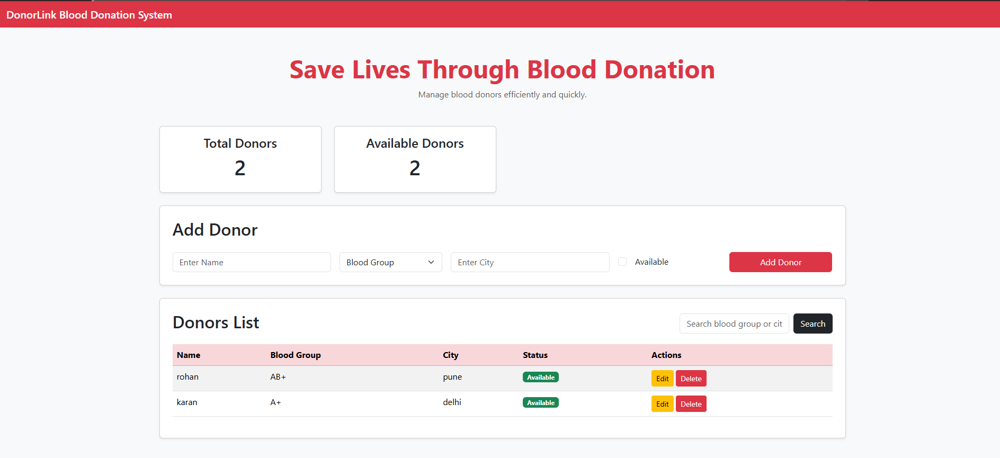
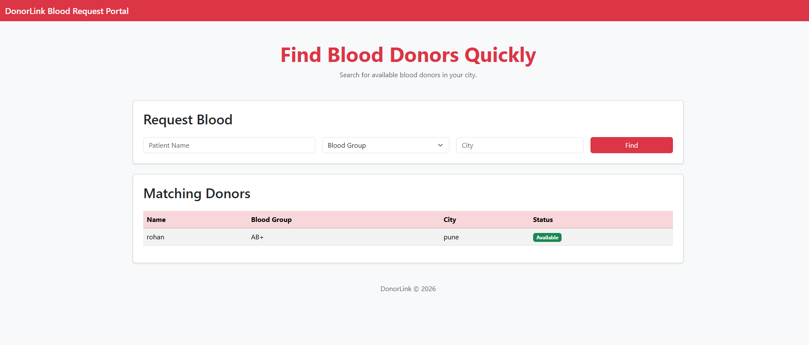

# 🩸 DonorLink

A Blood Donation Management System built using Spring Boot, Thymeleaf, JPA, and H2 Database.

## 🚀 Live Demo

### Donor Management
https://donorlink-9so0.onrender.com/donors

### Blood Request Portal
https://donorlink-9so0.onrender.com/requests

---

## 📌 Features

### Donor Management
- Add new donors
- View donor list
- Edit donor details
- Delete donors
- Search donors
- Track donor availability

### Blood Request Portal
- Submit blood requests
- Search donors by blood group
- Search donors by city
- View matching available donors

---

## 🛠️ Tech Stack

- Java 17
- Spring Boot
- Spring Data JPA
- Thymeleaf
- H2 Database
- Bootstrap 5
- Maven
- Git
- GitHub
- Render

---

## 🏗️ Architecture

The project follows MVC Architecture:

- Model
- View
- Controller
- Service Layer
- Repository Layer

---

## ▶️ Run Locally

Clone the repository:

```bash
git clone https://github.com/anmoln-27/DonorLink.git
```

Navigate to the project:

```bash
cd DonorLink
```

Run the application:

```bash
./mvnw spring-boot:run
```

Open:

```text
http://localhost:8080/donors
```

or

```text
http://localhost:8080/requests
```

---

## 🎯 Learning Outcomes

- Spring Boot Development
- MVC Architecture
- CRUD Operations
- Database Integration
- Thymeleaf Templates
- Deployment using Render
- Git & GitHub Workflow

---

## 📷 Screenshots

### Donor Management Page


### Blood Request Portal


---

## 👨‍💻 Author

**Anmol Nandwani**

